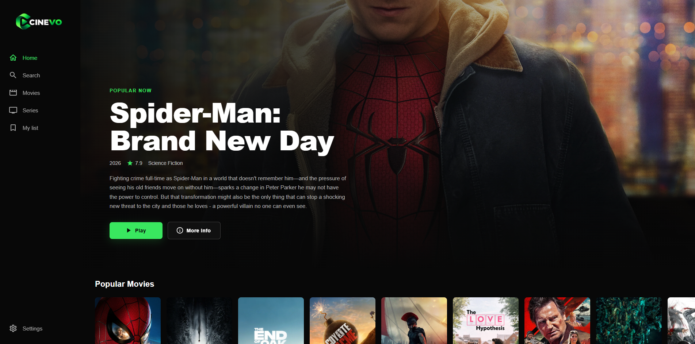
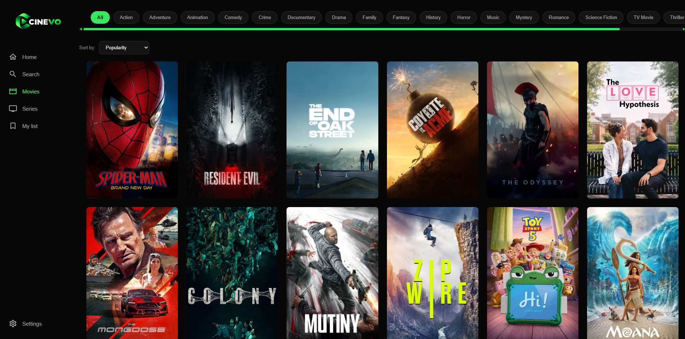
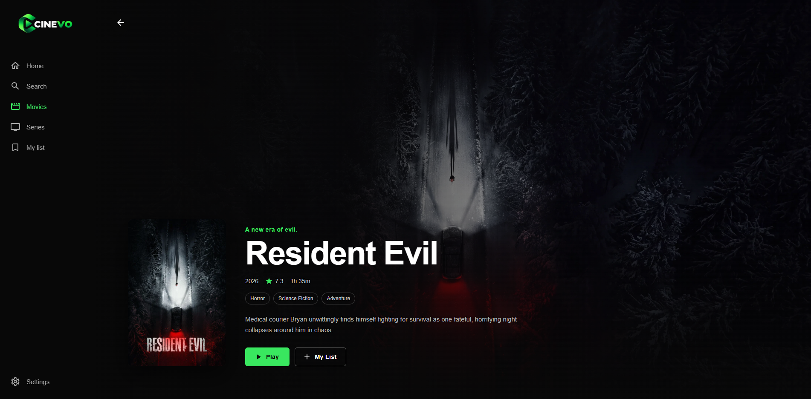
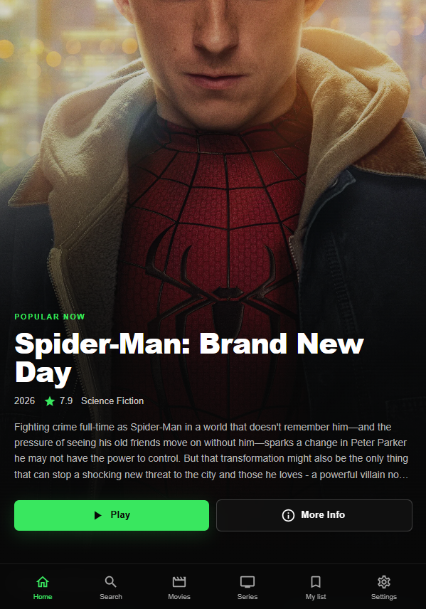

# 🎬 CINEVO

CINEVO is a modern and responsive movie and TV series streaming-platform interface built with React.

The application uses real data from the TMDB API and allows users to discover movies and series, search for content, explore detailed information, watch trailers, manage a personal watchlist, and customize their viewing preferences.

The project was built with a focus on reusable components, responsive design, API integration, state management, and a polished streaming-platform user experience.

## 🔗 Live Demo

**Live Website:** https://cinevo-streaming-platform.vercel.app/

**GitHub Repository:** https://github.com/dhmgiannakas-dev/cinevo-streaming-platform

---

## 📸 Screenshots

### Home



### Movies



### Movie Details



### Mobile



---

## ✨ Features

- Browse popular movies and TV series
- Explore top-rated and upcoming movies
- Filter movies and series by genre
- Sort content by popularity, rating, and release date
- Pagination for movie and series discovery
- Search across movies and TV series
- Debounced search requests
- Detailed movie and series pages
- Cast, director, and creator information
- YouTube trailer playback
- Recommended content
- Personal **My List** watchlist
- Persistent watchlist using Local Storage
- Persistent user settings
- Trailer autoplay preference
- Reduced motion accessibility option
- Adult content preference
- Loading, error, and empty states
- Custom 404 page
- Responsive navigation
- Desktop, tablet, and mobile layouts

---

## 🛠️ Tech Stack

- **React**
- **JavaScript**
- **Vite**
- **React Router**
- **Material UI**
- **CSS**
- **TMDB API**
- **Context API**
- **Local Storage**
- **Vercel**

---

## 🧠 What I Learned

Building CINEVO helped me improve my understanding of:

- Structuring a larger React application
- Creating reusable React components
- Working with multiple REST API endpoints
- Handling asynchronous requests with `async/await`
- Managing loading and error states
- Cancelling requests with `AbortController`
- Fetching multiple resources with `Promise.all`
- Building a reusable API utility
- Managing global state with React Context
- Persisting application state with Local Storage
- Creating controlled settings and UI preferences
- Implementing debounced search
- Dynamic routing with React Router
- Conditional rendering
- Responsive layouts for multiple screen sizes
- Building modal interactions and keyboard controls
- Improving accessibility with reduced-motion support
- Normalizing movie and TV series data into consistent structures
- Deploying a React SPA and configuring routing for production

---

## 🔎 Search

CINEVO includes a search experience powered by the TMDB multi-search API.

The search system includes:

- Debounced requests
- Request cancellation with `AbortController`
- Movie and TV series results
- Loading states
- Error handling
- Empty search states
- Responsive result layouts

---

## 🎥 Movie & Series Details

Each movie or series has a dedicated details page with information such as:

- Overview
- Rating
- Release or first-air date
- Genres
- Cast
- Director or creators
- Trailer
- Recommendations
- My List controls

Trailer data is retrieved from TMDB and displayed through YouTube.

---

## ❤️ My List

Users can add movies and TV series to their personal watchlist.

The list is managed globally using React Context and persisted with Local Storage, allowing it to remain available after refreshing or reopening the application.

Movies and series are uniquely identified using both their ID and media type.

---

## ⚙️ Settings

CINEVO includes persistent user preferences through the Settings page.

Users can control:

- **Autoplay Trailers**
- **Reduced Motion**
- **Include Adult Content**

Settings are managed through React Context and stored locally in the browser.

---

## 📱 Responsive Design

CINEVO is designed for desktop, tablet, and mobile devices.

### Desktop

Full sidebar navigation, large hero sections, content rows, and multi-column grids.

### Tablet

Compact sidebar navigation, responsive content grids, and horizontally scrollable genre filters.

### Mobile

Bottom navigation, two-column content grids, touch-friendly controls, and layouts optimized for smaller screens.

---

## 🌐 TMDB API

CINEVO uses the TMDB API to retrieve movie and TV series data.

API requests are handled through a reusable `tmdbFetch` utility.

The TMDB access token is stored in an environment variable and is not included in the repository.

Create a `.env` file in the project root:

```env
VITE_TMDB_TOKEN=your_tmdb_token
```

> This product uses the TMDB API but is not endorsed or certified by TMDB.

---

## 🚀 Getting Started

Clone the repository:

```bash
git clone https://github.com/dhmgiannakas-dev/cinevo-streaming-platform.git
```

Move into the project directory:

```bash
cd cinevo-streaming-platform
```

Install dependencies:

```bash
npm install
```

Create a `.env` file in the project root:

```env
VITE_TMDB_TOKEN=your_tmdb_token
```

Start the development server:

```bash
npm run dev
```

Create a production build:

```bash
npm run build
```

---

## 📁 Project Structure

```text
src/
├── api/
├── assets/
├── components/
├── context/
├── pages/
├── App.jsx
└── main.jsx
```

The application separates reusable UI components, page-level components, global contexts, and API logic to keep the codebase organized and maintainable.

---

## 🚀 Deployment

CINEVO is deployed on Vercel.

The application includes SPA routing configuration so React Router routes can be accessed and refreshed directly in production.

Production environment variables are configured through Vercel and are not committed to the repository.

---

## 👨‍💻 Author

**DhmGiannakas Dev**

GitHub: https://github.com/dhmgiannakas-dev

Built as a frontend portfolio project to demonstrate practical experience with React, REST APIs, routing, global state, persistent browser storage, responsive design, reusable component architecture, and production deployment.